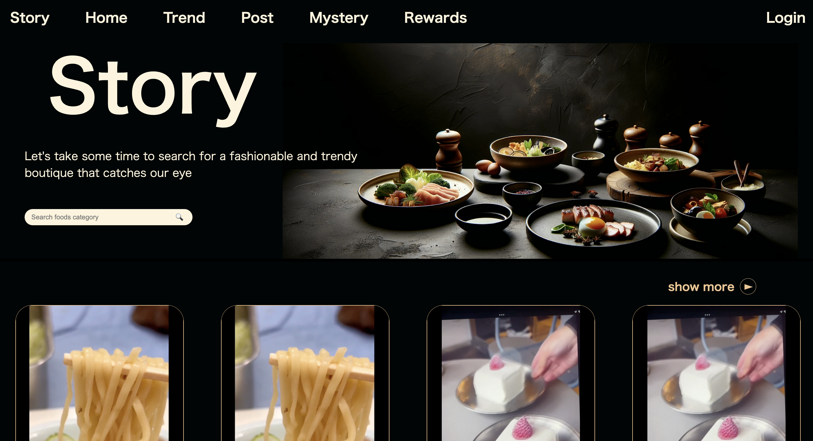

# Dynason-works
福井県で開催されたハッカソン「ダイナソン」で作成したWEBサイトです。　
- 作成期間：３日
- ＃URL: https://yoshiki0418.github.io/Dynason-works/

## 目的
既存のグルメサイトのレビュー偏りと画像の不一致問題を解決し、実際の利用者のリアルな体験を反映したユーザー中心グルメサイトを通じて、より透明で正確な飲食店情報の共有を目指しています。



## 特徴

- ユーザーの投稿から、飲食店情報に遷移する。
- ランダムモードで新たな食との出会いを創出
- 「Google 検索」や「SNS 」などの複数のページを経由する必要ない

## 技術スタック

- HTML/CSS
- JavaScript

# 共同開発者
### [Teruさん](https://github.com/blueshine14)


## セットアップ

```bash
git clone https://github.com/yourusername/yourrepositoryname.git
cd yourrepositoryname
npm install
npm start
